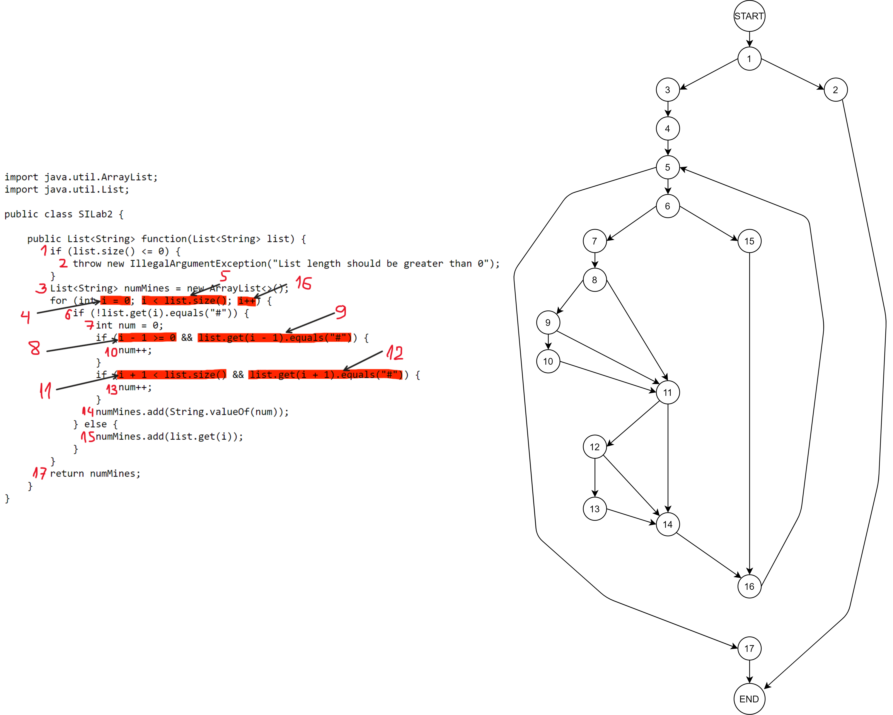

# Втора лабораториска вежба по Софтверско инженерство
## Владимир Стојчески, бр. на индекс 171248

### Група на код:
Ја добив групата на код 5

### Control Flow Graph

### Цикломатска комплексност
Цикломатската комплексност на овој код е 8, истата ја добив преку формулата P+1, каде што P е бројот на предикатни јазли. Во случајoв P=7 (1, 5, 6, 8, 9, 11, 12), па цикломатската комплексност изнесува 8.

### Тест случаи според критериумот Every path
Бидејќи функцијата има премногу патеки, јас одлучив да направам рестрикција на истите врз база на самата дефиниција на функцијата. Во дадена итерација се проверуваат 3 елементи од листата од доменот D = (“0”, “#”). Не вклучуваќи ги и специјалните случаи, имаме 8 уникатни случаи (2^3): 000, 00#, 0#0, 0##, ###, ##0, #0#, #00.  
  
Специјални случаи се оние кога се испитува првиот, односно последниот елемент од листата каде што не постои елемент лево, односно десно, од оној што се проверува. Може да нема ниту лево ниту десно само ако должината на листата е 1.  
00, 0#, ##, #0, 0, #.  
  
Врз основа на Control Flow Graph-от се добиваат следните уникатни патеки:  
start – повик на функцијата, end – крај на функцијата  
start, 1, 2, end // exception  
start, 1, 3, 4, 5, 6, 7, 8, 11, 14, 16, 5, 17, end // 0  
start, 1, 3, 4, 5, 6, 7, 8, 11, 12, 14, 16, 5, 6, 7, 8, 9, 11, 14, 16, 5, 17, end // 00  
start, 1, 3, 4, 5, 6, 7, 8, 11, 12, 13, 14, 16, 5, 6, 15, 16, 5, 17, end // 0#  
start, 1, 3, 4, 5, 6, 7, 8, 11, 12, 14, 16, 5, 6, 7, 8, 9, 11, 12, 14, 16, 5, 6, 7, 8, 9, 11, 14, 16, 5, 17, end // 000  
или start, 1, 3, 4, 5, 6, 7, 8, 11, 12, 14, 16, 5, (6, 7, 8, 9, 11, 12, 14, 16, 5), 6, 7, 8, 9, 11, 14, 16, 5, 17, end // 0000  
start, 1, 3, 4, 5, 6, 15, 16, 5, 17, end // #  
start, 1, 3, 4, 5, 6, 15, 16, 5, 6, 7, 8, 9, 10, 11, 14, 16, 5, 17, end // #0  
start, 1, 3, 4, 5, 6, 7, 8, 11, 12, 14, 16, 5, 6, 7, 8, 9, 11, 12, 13, 14, 16, 5, 17, end // 00#  
start, 1, 3, 4, 5, 6, 7, 8, 11, 12, 13, 14, 16, 5, 6, 15, 16, 5, 17, end // 0##  
или start, 1, 3, 4, 5, 6, 7, 8, 11, 12, 13, 14, 16, 5, (6, 15, 16, 5), 17, end // 0##  
start, 1, 3, 4, 5, 6, 7, 8, 11, 12, 13, 14, 16, 5, 6, 15, 16, 5, 6, 7, 8, 9, 10, 11, 14, 16, 5, 17, end // 0#0  
start, 1, 3, 4, 5, 6, 15, 16, 5, 6, 15, 16, 5, 6, 7, 8, 9, 10, 11, 14, 16, 5, 17, end // ##0  
или start, 1, 3, 4, 5, (6, 15, 16, 5), 6, 7, 8, 9, 10, 11, 14, 16, 5, 17, end // ##0  
start, 1, 3, 4, 5, 6, 15, 16, 5, 6, 7, 8, 9, 10, 11, 12, 13, 14, 16, 5, 6, 15, 16, 5, 17, end // #0#  
start, 1, 3, 4, 5, 6, 15, 16, 5, 6, 7, 8, 9, 10, 11, 14, 16, 5, 6, 7, 8, 9, 11, 14, 16, 5, 17, end // #00  
  
Да забележеме дека листите “##” и “###” не ги вклучив како уникатни затоа што патеката во циклусот се повторува, за разлика од “0”, “00” и “000”, каде што патеките на овие листи се различни.  
Во циклусот на функцијата ќе се случи **барем една циклусна патека** од горе наведените.  
Со овој метод исто така се елеминираат и патеките кои никогаш нема да се случат.  
На пример патеката: start, 1, 3, 4, 5, 17, end.

### Тест случаи според критериумот Multiple-Condition
if (i-1>=0 && list.get(i-1).equals("#"))     
Combination | Possible Test Case
------------ | -------------
TT | #**0**
TF | 0**0**
FX | **0**  

if (i+1<list.size() && list.get(i+1).equals("#"))  
Combination | Possible Test Case
------------ | -------------
TT | **0**#
TF | **0**0
FX | **0**  

Комбинациите ќе се случат кога се итерира по елементот кој е со задебелен фонт (болдиран).  

### Објаснување на напишаните unit tests
Unit тестовите ги напишав со помош на assert изрази.  
Во класата напишав два методи за секој критериум соодветно.  

Every path:  
За првата патека ги искористив assertThrow каде што се проверува дали функцијата фрла исклучок, и assertTrue каде што се проверува дали е фрлен очекуваниот исклучок.  
За сите останати тестови, ги искористив горе наведените тест случаи со помош на assertEquals, каде што се проверува резултатот.  
Дополнително, напишав и еден измешан (mixed) тест во кој се гледа дека во својата природа е составен од уникатните патеки кои ги наведов погоре (0#00##0#0##00#0#0).  

Multiple-Condition:  
Тестовите ги напишав преку assertEquals за тест случаите од табелите дадени погоре. Сите тест случаи тука се повторуваат со некои од тестовите од Every path.
